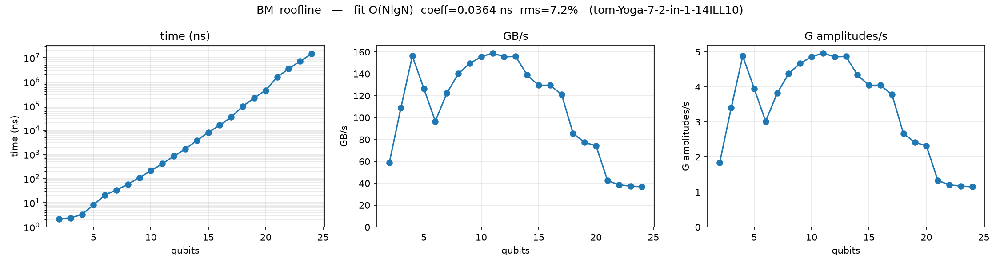
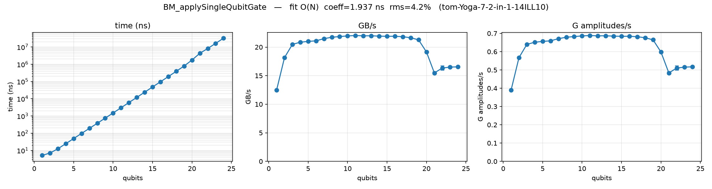
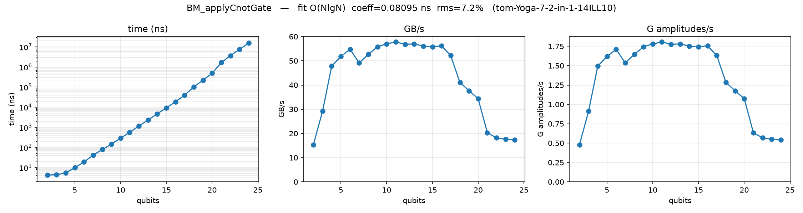
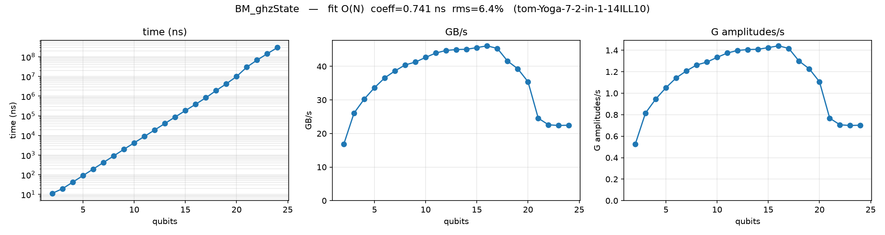
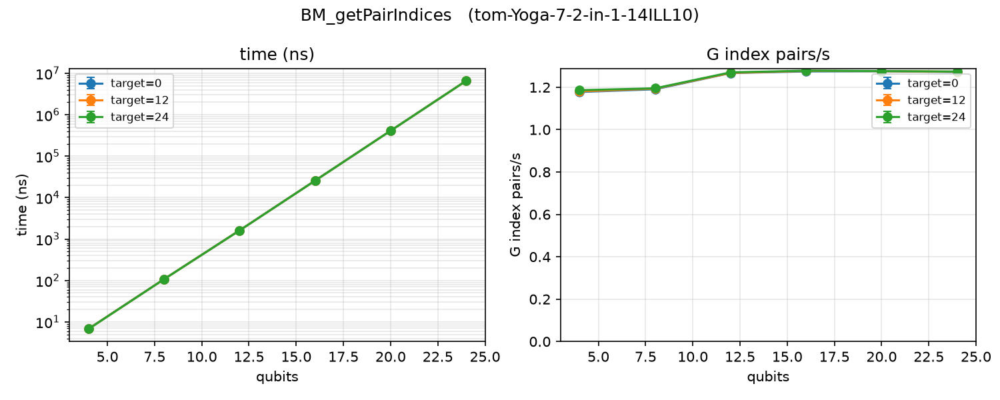
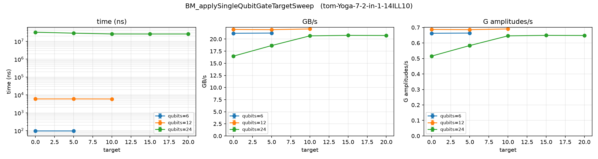

# Benchmark Insights

## Hardware Rooflines

### System Specs

- git sha: 16f529f
- date: 2026-07-28 10:08
- machine: "tom-Yoga-7-2-in-1-14ILL10",
- CPU:   Intel(R) Core(TM) Ultra 7 258V, 8 Cores
    - "mhz_per_cpu": 4700,
    - "cpu_scaling_enabled": true,
    - Caches:  (on performance core)
        - L1d       48K    
        - (L1i       64K)     
        - L2       2.5M     
        - L3        12M     
- compiler: g++ (Ubuntu 15.2.0-16ubuntu1) 15.2.0  
- build type: Release
- build flags: -O3 -DNDEBUG
- benchmark library: google/benchmark v1.9.2

### Methodology

#### Correctnes

Our functions get tested by self written Unit test with the testing harness google/test. To further ensure correctnes we cross check our circuit results with Qiskit Circuit results and flag if there are differences. 

#### Benchmarking 

This is the first naive CPU implementation without further optimization.

There are 5 families, all exclude State and Circuit Constructions, shifting the focus of the heavy calculations and memory transfers.

 - Single qubit gate: Runs H Gate on |0...0> State
 - Cnot qubit gate: Runs Cnot Gate on |0...0> State
 - GHZ State: Runs H Gate and then n-1 CNOT Gates on |0...0> State
 - Get Pair Indices: Calculates Pair Indices from Pair Numbers
 - Single Qubit Gate Target Sweep: Applies H Gate on different target qubits

Each family was run 5 times with a median coefficient of variation of 0.41%, the max CV being 2.56%. 

All families count 32 bytes of traffic for every amplitude a gate updates: 16 bytes read plus 16 bytes written, one complex<double> in each direction. The single-qubit gate updates all 2ⁿ amplitudes and is therefore charged 32·2ⁿ bytes per call. The CNOT only updates the half of the state where the control bit is set, so the same rule gives it 16·2ⁿ. GHZ is charged 16·2ⁿ·(n+1) — one H plus n−1 CNOTs.

The rule is consistent, so GB/s measures useful traffic within a family. But it is not a speed comparison between families: the CNOT is charged half the bytes for doing the same number of loop iterations, so its GB/s understates it by 2×. Cross-family comparisons in this document use time per loop iteration instead.

The exact numbers can be found in the 'numbers.md' of each benchmark.

### Theoretical Limits: [Intel(R) Core(TM) Ultra 7 258V, 8 Cores](https://www.intel.com/content/www/us/en/products/sku/240957/intel-core-ultra-7-processor-258v-12m-cache-up-to-4-80-ghz/specifications.html)

All the CPU Benchmarks are being run on this CPU

Maximum Bandwidth = DRAM bandwidth * Bus size / 8 / 1000
Maximum Bandwidth = 8533 MT/s * 128 bit bus width / 8 / 1000 = <b>136.528 GB/s</b>

 Looking at our State representation — a Vector of complex<double>. 
 Each amplitude requires 16 Byte, therefore a n Qubits-State will grow to Size 2^n * 16 Bytes. 

Knowing this Size we can now compute where our Vector will be cached in.

 Hypothesis: 

 L1 = 48KiB = 48 * 1024 = 49152 Bytes

 Solve: 
 2^n* 16 = 49152 for n 
 -> n = 11.5 

 All states with 11 Qubits and less should fit in our L1 Cache.

 Likewise:

 L2 -> n = 17.3 
 L3 -> n = 19.6

DRAM(32GiB) n = 31: 

This is a theoretical Number since the OS itself needs DRAM and would not be able to spend all resources to just hold the State.

### Practical Limits: 

To have a roofline of this exact machine all benchmarks are also compared to a simple arithmetic function. 
We read the state, multiply with a double and write back to the amplitudes. This is one of the most rudimentary operations and should provide a good limit for our hardware.

 

Observation:

Our processed data per second is far from the theoretical bandwidth, strangely enough in both directions.

Overprocessing (Qubits 2-14):
The memory bandwidth limit is calculated for DRAM. Since the States are so small they can fit entirely into the L3 cache or lower, the theoretical DRAM limit does not apply.

Another noteworthy anomaly is the irregular curve from Qubit sizes 2 till 10. This is likely to be caused by the overhead from the loop and google benchmarks measuring methods. 

Heavy under processing(Qubits 20+)
One possible explanation is that we operate our function on one single core, which is not able to fill the whole memory bandwidth. 
This could be solved with a multi-core implementation. Which will be the focus for our GPU Implementation.

Using Intels Memory Checker we get a practical limit for Read-Write operation(multi-core) of 
1:1 Reads-Writes : 97666.1 MB/sec
Still shy of our theoretical 136.528 GB/sec but it is expected to never hit the true roofline

Wrong Theory:

More interestingly our predicted performance drops happen later than anticipated. 

| Cache Switch (from/to)| Predicted Drop | Actual Drop | 
| -------- | -------         |------       |
| L1->L2       | 11.5 (12)            |        14     |
| L2->L3       | 17.3  (18)          |        18     |
| L3->DRAM       | 19.6 (20)           |        21     |

Possible Explanation: 
The original hypothesis assumed that as soon the state does not fit in one cache the whole state gets transferred to the next higher level. The data suggest a different approach. 
The state gets partially fitted in a Cache Level, which results in only partial cache misses. This creates a somewhat gradual performance decrease until the majority of the state lives in the next cache.

Keeping in Mind:
L2 as well as L3 Cache are unified, so the instructions from our Google benchmark loop will also occupy space. 

More important the L3 Cache is shared amongst all 4 performance Cores, meaning the OS and outside applications could occupy space as well, leaving less for the state. 

## 2026-07-28 - CPU baseline (naive)

### Results

#### Headline Numbers

Note: This benchmark is single core and we use complex<double>

|family| in-cache plateu(11 qubtits) |  DRAM(24 qubits)|
|---   |---              |---              |    
|roofline|   	159.49 GB/s  , 0.20 ns/iter ,   0.94 cycles/iter                |   36.86 GB/s , 0.868 ns/iter, 4.08 cycles/iter |
|single qubit H| 22.03 GB/s  , 2.90 ns/iter ,   13.66 cycles/iter       | 16.57 GB/s , 3.86 ns/itr, 18.16 cycles/iter|
|CNOT|    	57.88 GB/s  , 0.55 ns/iter ,   2.60 cycles/iter | 	17.34 GB/s , 1.846 ns/itr, 8.68 cycles/iter|
|GHZ | peak 46.15 GB/s at 16 qubits | 22.53 GB/s |

#### Single Qubit Gate

Observation
Throughout L1 to L3 cache the throughput seems stable, this suggests that the function is not memory bound rather computation bound. It is up to 7.5x slower than our roofline function.

Interestingly enough there is a steep drop between the 20 and 21 qubit mark, this is likely due to the relocation of the state to DRAM. 

We can tell from the roofline that our memory bound is at roughly 38 GB/s and the compute bound for the single-qubit gate lies at roughly 22 GB/s. 
Why is the current throughput 16 GB/s instead of 22GB/s, for high qubits?

Hypothesis:

Our prefetching is not able to provide Cache-Lines fast enough, causing stalls and since the DRAM latency is too high it can't be hidden. 

#### CNOT Gate

Observation:
1. Again we see a compute bound for the L1 and L2 Cache, here the performance degradation happens earlier, as the throughput already starts to decrease in transition to L3 Cache and onwards. 

2. One strange observation is the higher throughput of the CNOT Gate compared to our singleQubitGate( up to 5.1x faster). The seemingly more complex Cnot gate costs apparently less than our single qubit gate. 
For a fair comparions we will look at the time it took for one pair to be calculated. 

At qubit 24 this advanteage collapses to 2.1x. 

|qubits       | H ns/pair   | CNOT ns/ pair |  H / CNOT|
| -------- | -------         |------       |------       |
|8|2.95| 0.61 | 4.8x|
|12     | 2.91      | 0.56         | 5.2×     |
| 16     | 2.92      | 0.57         | 5.1×     |
| 20     | 3.34      | 0.93         | 3.6×     |
| 24     | 3.87      | 1.85         | 2.1×|

Explanation: 
1. The drop probably stems from the same cause as in our single qubit gate. The high latencies can not be hidden by our CPU anymore. Since our operational speed is a lot higher than with the single qubit gate, this happens one memory stage earlier and is visible even with the L3 Cache. We are not able to prefetch enough lines to hide our latencies. 

2. Looking closer at our functions the speed difference is quite obvious. Being made up by branching logic, the Cnot Gates eliminates a lot of operations. The remaining operations are amplitude swap without any computations, compared to the heavy matrix arithmetics in our singleQubitGate. 
The drop in the performance adavantage 5.1x -> 2.1x is probably caused by the fact that both function expereince heavy stalls and have to wait on the DRAM
This performance difference might be worth looking at after the GPU optimization, since with the single Qubit we will be able to compute parallel whereas for our branching we will mask. So my intuition would suggest that in the gpu version the single qubit will surpass our cnot gate in performance.

#### GHZ State

Observation: performance ramps up logarithmically to a peak of 46 GB/s at 16 qubits, starts to fall from qubits 17 and flattens roughly at 22 GB/s from 22 qubits. 

Although GHZ State consists of N-1 Cnot gates, asymptotic we could say it consists of just Cnot Gates the performance does not match the CNOT Gate output. In cache it is 18% slower (46.1 GB/s vs  56.2 GB/s at 16 qubits).

It is actually faster than our raw CNOT Gate Operation at high Qubits. 22.5 GB/s vs 17.3 GB/s

Hypothesis: 
The general performance drop – in the lower qubits – is uninteresting and very likely the overhead from our circuit object. It runs each gate as an Operation in a list, this incurs overhead which we did not have when we benchmarked the raw function. 

Looking at our numbers we can compare the 18 % and evaluate overhead vs the single H Gate slowing us down. 

one GHZ call at 16 Qubits takes 386237.7371ns
one cnot 18663.4173 ns
one single  95527.2835 ns

Raw Ghz time = H + Cnot * (n-1)
Raw Ghz= 375478.543 ns

So we have residuals(Overhead, cache misses) slowing us down by 10759.1941 ns or 3 % 
This is minimal and clarifies the 18 % percent from earlier. 3 % do not constitute for further improvement, at least not the first iteration. 

One unexpected effect is the ramp up of the performance. My first instinct is that the H Gate Operation has slower speed and pushes the output per second down, this explains the logarithmic shape of the ramp up well. The initial overhead also takes a big toll on our performance making the lower Qubits increase in speed the more gates get chained.

By far the most interesting observation, is the fact that our GHZ is faster than our CNOT Function for high qubits. This is extremely unintuitive seeing its more complex and should be slower with all the overheads. This speed up could be related to target bits. With our CNOT Gate we always took the same target and control bit being 0 and 1 respectively. Our GHZ State takes i, i+1 as control and target. Increasing the distance between Indices in a pair. 

#### Results: Unique

There will be two benchmarks which we will introduce now but will not elaborate more in future benchmarks for the sake of avoiding redundancy.

##### GetPairIndices

The function is as expected stable and very likely to be compute-bound. 
We operate directly through bit modifications and without branches. Thanks to the bit operations we do not see a performance degradation for pairs which are far apart (e.g., 1 and 2^n -1).

Importantly, we can not look at the speed. Since the function is seemingly harness bound. 
Looking at the cycles/iter we can see we hover at roughly 3.70. (The small flucations stem from the google benchmark overhead, timing and loop setups affect the measurement less with more iterations).
If we know look at our CNOT Gate function – we have for qubit 8 – 2.85 Cylces per Iteration. 
This is a contradiction since CNOT, calculates Pair Indices, reads the value of the the amplitudes and writes back to them. 

Since Get Pair Indices is a pure fucntion which reads input, computes and just returns a value. The compiler will evalute the code as dead if we dont use the value. Since we are doing an isolated test, the value never gets used. To combat this we used, the `DoNotOptimize` function, which explicity forces the function to execute. This does not resemble our real work flow since the compiler would be able to optimize and inline the function, calling it while waiting for loads or storing. 

So the important insight is that Get Pair Indices is harness bound at the moment and we can not measure future improvements 

##### Apply Single Qubit Gate Target Sweep

Explanation: This Benchmark builds various States of different Sizes and checks whether different target Bits influence operation speeds. 

Original Hypothesis: Yes there will be an influence, 
high target bit -> amplitudes further apart in memory -> two accesses to separate cache lines. Since the Amplitudes do not lie next to each other in memory, we can not access them with one cache-line, needing two which reduces our speed since we have to wait until both arrive.

The original hypothesis is inverted. The further apart in memory the amplitudes are, the faster the function goes. We can see that for a 24 Qubit State with Target Bit 0 we get 16GB/s. After we increase the target bit to 10 and higher this degradation plateaus at 20.7 GB/s vs the 22.0 in-cache bound — 94%. We are approaching our cache-computation bounds.
This is effect could be already seen in the GHZ State Test. It performed faster than the raw CNOT Test, with the same reason. Our bits become further apart with later CNOT Gates.

Possible Explanation: The processor prefetches amplitudes to queue them to be processed. If the pairs are next to each other the processor will prefetch the whole page. If we have two far apart pairs the processor will cause parallel memory access to get the two respective pages.  Essentially doubling our lines in flight and hiding the dram latency. 

### Conclusion Initial Benchmark

#### Cost Model

|qubits| BM_Roofline | BM_applyCnotGate | BM_applySingleQubitGate | 
|---   |---          |---               |---                      |  
|8(in-cache)     | 1.07 cylce per amp | 2.85 Cycle per pair | 13.84 Cylce per pair| 
|24(DRAM)    | 4.08 cylce per amp | 8.68 Cycle per pair | 18.16 Cylce per pair| 
|---   |---          |---               |---                      |  
|| +3.01 per amp| +5.8 per pair| +4.3 per pair|

Roofline: Touching an Amplitude
CNOT: index calculations, branch and swap. +1.78 Cycle per pair.
Cnot only touches pairs where the control bit is set 1, half the amps of our state but then reads and writes 2 amps, so the total is 1 amp in average which makes the comparison 1:1 with the roofline
H Gate: Same index same writing but matrix operation. +10.99 Cylces per pair.

// to DO : revise cycles and h gate moves more than cnot gate

Roofline states the tax for moving from cache to DRam is +3 cycles per amp. Looking at the cnot gate we get 5.8 per pair. Since the CNot touches two amps it roughly matches the expected cost increase. 
Interestingly the single Qubit only increases by +4.3, the long calculations are able to hide the memory slowdown. The function keeps calculatin while new pairs are slowly moved through memory. This is not a clear compute-bound rather a mix of both. 
Wherea as the roofline and Cnot Gate are purely memory bound. 

### Improvements

#### Improving Performance 

The most extreme performance gain would be achieved by enabling more cores. We are nowhere near our maximal memory bandwidth and should be able to at least double our performance here. 

Afterward it would be worth to see if we can remove arithmetic bottlenecks, since we tend to be compute-bound rather than memory-bound. 
At last, we should look closer into our prefetching and cache misses to hide dram latencies. 
Our focus should be the single qubit operations, since the matrix calculations seem to slow us done the most. 

#### Improving Methodology 

The benchmark for H Gate is currently a bit of a black box, 
so for future benchmarks its worth adding: 
SingleQubitGate-Index Only: load both amplitudes, read and write back but without any math. -> this will measure our artithmetics

SingleQubitGate-Sequential Index: use a loop to go through the indices and compute sequentially without getPairIndices function. -> this will measure our GetIndicies Cost in context

### Reproduction of this Benchmark 

Prerequisites: Linux (the run is pinned with `taskset`, from util-linux), a C++20
compiler, CMake >= 3.25, Python 3, and network access on the first configure —
googletest, nlohmann/json and google/benchmark are all fetched by FetchContent at
pinned versions.

1. Python environment, needed only for the plots:

       python3 -m venv .venv
       .venv/bin/pip install -r requirements.txt

2. Configure Release with benchmarks enabled. Without `QSIM_BENCHMARK=ON` the
   `bench` target does not exist at all:

        cmake --preset benchmark                        (once, to configure)

3. Build and run. Writes `benchmarks/results/latest.json`:

       cmake --build --preset benchmark --target bench

4. Plot, and keep the run under a label:

       .venv/bin/python scripts/plot_benchmarks.py --overlay --caches --save cpu-baseline-naive

   This creates `benchmarks/results/<date>-<label>/` holding a copy of the JSON, the numbers.md
   and every plot used in this document. The date comes from the JSON's own
   context block rather than from the clock, so re-plotting an old run still
   files it under the day it was measured.

`latest.json` and `latest/` are gitignored; only labelled runs are committed.

#### What has to match for the numbers to be comparable

The `bench` target pins to CPU 3 with `taskset -c 3`. On this machine CPUs 0-3
are P-cores (4.8 GHz, 2.5 MB private L2) and CPUs 4-7 are LPE-cores (3.7 GHz,
4 MB shared), so which core the scheduler picks changes both the clock and the
cache, and unpinned runs are not comparable. **On any other machine that
number means something different and must be changed.**

The rest of this run: 5 repetitions, aggregates only, Release (-O3 -DNDEBUG),
g++ 15.2.0, google/benchmark v1.9.2, and cpu_scaling_enabled was true (median CV
0.41%, which does not move the numbers materially). The `context` block inside
`results.json` next to the plots is the authoritative record — host, date, and cache sizes all come from there, not from this document.
